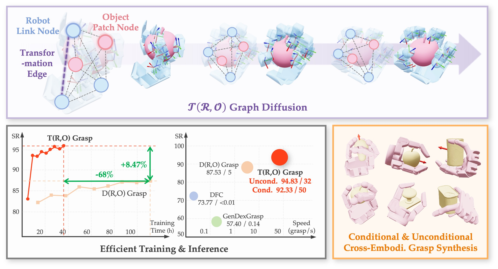

# $\mathcal{T(R,O)}$ Grasp

> This is Zhang Jingzhi's lightweight reproduction and bimanual-development
> snapshot, based on upstream commit
> `8e9719777a787b347dc60ac998c63900d057229e`. See
> [REPRODUCTION_SETUP.md](REPRODUCTION_SETUP.md) for the included scope and
> [environment/README.md](environment/README.md) for portable environment
> reconstruction.

Official Code Repository for **$\mathcal{T(R,O)}$ Grasp: Efficient Graph Diffusion of Robot-Object Spatial Transformation for Cross-Embodiment Dexterous Grasping**.

[Xin Fei](https://xinfei21.github.io/web/)<sup>1,2\*</sup>, [Zhixuan Xu](https://ariszxxu.github.io/)<sup>1,2\*</sup>, Huaicong Fang<sup>3</sup>, [Tianrui Zhang](https://ztr583.github.io/)<sup>1</sup>, [Lin Shao](https://linsats.github.io/)<sup>1,2</sup>

<sup>1</sup>National University of Singapore, <sup>2</sup>RoboScience, <sup>3</sup>Zhejiang University

<sup>*</sup> denotes equal contribution


<p align="center">
    <a href='https://arxiv.org/abs/2510.12724'>
      
    </a>
    <a href='https://nus-lins-lab.github.io/trograspweb/'>
      
    </a>
</p>

<div align="center">
  
</div>

In this paper, we introduce $\mathcal{T(R,O)}$ Grasp, a diffusion-based framework that efficiently generates accurate and diverse grasps across multiple robotic hands. We first define $\mathcal{T(R,O)}$ Graph to represent spatial transformations of robotic links and objects with auxiliary geometry information. Next, we introduce a graph diffusion model that enables both unconditioned and conditioned grasp synthesis.

## Installation

### 1. Create Conda Environment

```bash
conda create -n tro python==3.10 -y
conda activate tro
```

Note: Due to the constraints of the [Pyroki](https://github.com/chungmin99/pyroki) toolkit, Python 3.10 or higher is required.

### 2. Install Packages

Clone this repository, install the dependencies by running:
```bash
pip install -r requirements.txt
```

### 3. Isaac Gym (For Validation)

For simulation validation, [Isaac Gym](https://developer.nvidia.com/isaac-gym/download) is required. We recommend to install Isaac Gym in a dependent conda environment. For instance, install Isaac Gym by running:

```bash
conda create -n isaac python==3.8 -y
conda activate isaac

tar -xvf IsaacGym_Preview_4_Package.tar.gz
cd isaacgym/python
pip install -e .
```

Then, update the environment name and variables in `validate_isaac()` in `validation/validate_utils.py`.

## Data and Checkpoint

### 1. Dataset

Please refer to [$\mathcal{D(R,O)}$ Grasp](https://github.com/zhenyuwei2003/DRO-Grasp) for dataset preprocessing. Download the filtered CMapDataset and extra training data for XHand and Leaphand [here](https://drive.google.com/file/d/14cXeVfpJfYde02cDa_sMz8adR5SvPGo7/view?usp=drive_link). After download, unzip `data.zip` into `./data` folder.

### 2. Model Checkpoints

Model checkpoints are available [here](https://drive.google.com/file/d/1idJy2EVPx9U2UpI96XftijfylJomAiGO/view?usp=drive_link). We offer versions trained on Allegro, Barrett, and ShadowHand individually, as well as multi-hand models for full and partial object observations.

### 3. Repository Structure


```bash
TRO-Grasp
├── ckpt                        # checkpoints
│   ├── allegro.pth
│   ├── barrett.pth
│   ├── shadowhand.pth
│   ├── multi_hand.pth
│   ├── partial.pth
│   ├── vqvae.ckpt              # pretrained VQ-VAE weight
├── config                      # configuration files
├── data                        # downloaded datasets
│   ├── CMapDataset             # original CMapDataset
│   ├── CMapDataset_filtered    # filtered CMapDataset
│   ├── data_urdf               # URDF files
│   ├── PointCloud              # Object and Robot point clouds
├── dataset                     # dataset code
├── model                       # TRO-Grasp model
├── utils                       # multiple utilities
├── validation                  # code for Isaac Gym validation 
├── test.py                     # test scripts
└── train.py                    # train scripts
└── vis.py                      # visualization scripts
```

## Train

To train $\mathcal{T(R,O)}$ Grasp on new embodiments, please follow these steps:

1. Generate your custom grasping dataset and save it as a `.pt` file with the following format:

```bash
custom_dataset.pt             # data dict
├── info                      # dataset info dict
│   ├── hand_1                # embodiment name
│       ├──robot_name         # embodiment name
│       ├──num_total          # total number of grasp demonstrations for hand_1
│       ├──num_upper_object   # maximum number of objects, default to 1,000
│       ├──num_per_object     # dict of grasp demonstration counts per object
│   ├── ...
└── metadata                  # list of grasp demonstrations, in (joint values, object_name, robot_name) format
```

2. Modify dataset configuration in `config/train.yaml` to make sure your custom dataset can be located.

3. Run the following script for model training:

```bash
  python train.py --config config/train.yaml
```

A wandb project will be created to trace the training process, and all checkpoints are saved in `$train.save_dir$/ckpt`.

## Validation

To validate the model performance, please modify the configuration in `./config`, here are some key parameters you may modify:

1. `dataset`: dataset configuration of the validation dataset. `batch_size` controls the number of sample per object within the dataset. We set `batch_size=100` during the evaluation process in our paper.

2. `model`: model configuration. `inference_config` controls the inference mode, please follow examples in `config/test_palm_unconditioned.yaml` and `config/test_palm_conditioned.yaml` to support unconditioned and conditioned grasp synthesis.

Then, run the following script for validation:

```bash
  python test.py --config $PATH_TO_TEST_CONFIG$
  # Note: export JAX_PLATFORM_NAME=cpu to run Pyroki on CPU, which can reduce memory consumption
```

After evaluation, you will get a `res.txt` to record all evaluation metrics, and a `vis.pt` for visualization. We provide an example to visualize the grasp synthesis results in `./vis.py`.

## Citation
If you find our codes or models useful in your work, please cite:
```
@misc{fei2025trograspefficientgraph,
      title={T(R,O) Grasp: Efficient Graph Diffusion of Robot-Object Spatial Transformation for Cross-Embodiment Dexterous Grasping}, 
      author={Xin Fei and Zhixuan Xu and Huaicong Fang and Tianrui Zhang and Lin Shao},
      year={2025},
      eprint={2510.12724},
      archivePrefix={arXiv},
      primaryClass={cs.RO},
      url={https://arxiv.org/abs/2510.12724}, 
}
```
